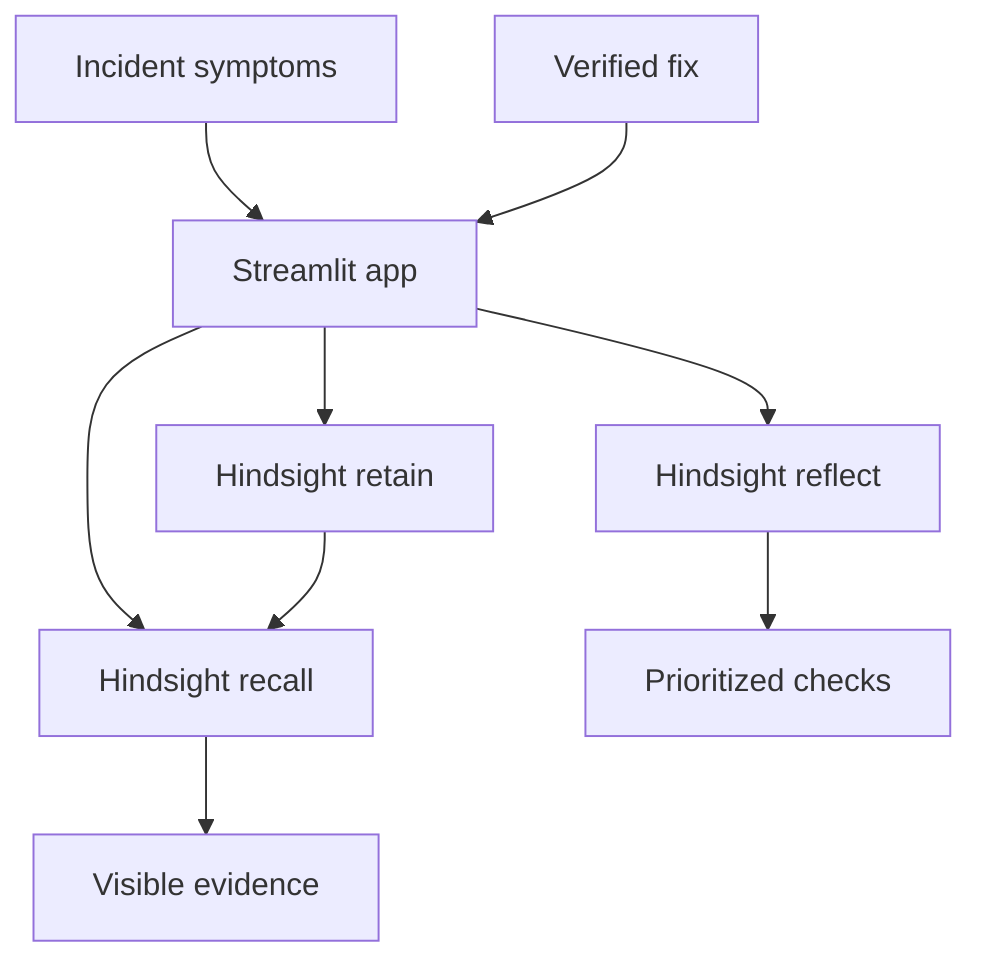

# ResolveLoop

An incident investigation agent for backend engineering teams. It recalls confirmed fixes from earlier service incidents and suggests targeted checks for a new failure. All incidents and logs in the demo are fictional.

## Why memory matters

When an API returns 401 after deployment even though login succeeds, a stateless assistant gives generic checks. Once an engineer verifies that a gateway route dropped the Authorization header, Hindsight retains that outcome. A related failure in another service recalls the earlier incident and prioritizes checking header forwarding. A past fix is evidence to investigate, not proof of the new root cause.

## Run on Windows PowerShell

Requires Python 3.10+ and a [Hindsight Cloud](https://ui.hindsight.vectorize.io/) API key.

```powershell
py -m venv .venv
.\.venv\Scripts\python.exe -m pip install -r requirements.txt
Copy-Item .env.example .env
# Edit .env and insert your Hindsight key; never commit it.
.\.venv\Scripts\python.exe -m streamlit run app.py
```

If you ran an earlier version, change `HINDSIGHT_BANK_ID` in your existing `.env` to `resolveloop-backend-demo` for a fresh bank. The first investigation attempts to create it. Hindsight `reflect` generates the answer, so there is no separate LLM key.

## Architecture



## Demo

1. In an empty bank, investigate `INC-204`: `orders-api` returns 401 for valid bearer tokens after deployment; login succeeds, but downstream logs show no Authorization header.
2. Record: “A gateway configuration change dropped the Authorization header. Restored forwarding and verified GET /api/orders returned 200 with a valid token.” Tick verification and retain.
3. Investigate `INC-205`: `billing-api` returns 401 with the same missing header symptom. Show the retrieved incident and the more targeted suggestion.

## Hindsight integration

- `client.recall(...)` retrieves relevant prior incident outcomes.
- `client.reflect(...)` generates checks using memory while distinguishing evidence from hypotheses.
- `client.retain(...)` saves a human-confirmed root cause and fix for later incidents.
- The bank persists across restarts; the ID is configured in `.env`.

## Limits

This prototype does not access real logs or production infrastructure. Similar symptoms can have different causes. A production system would require approved log ingestion, authentication, tenant isolation, audit trails, and evaluation against known incidents.
